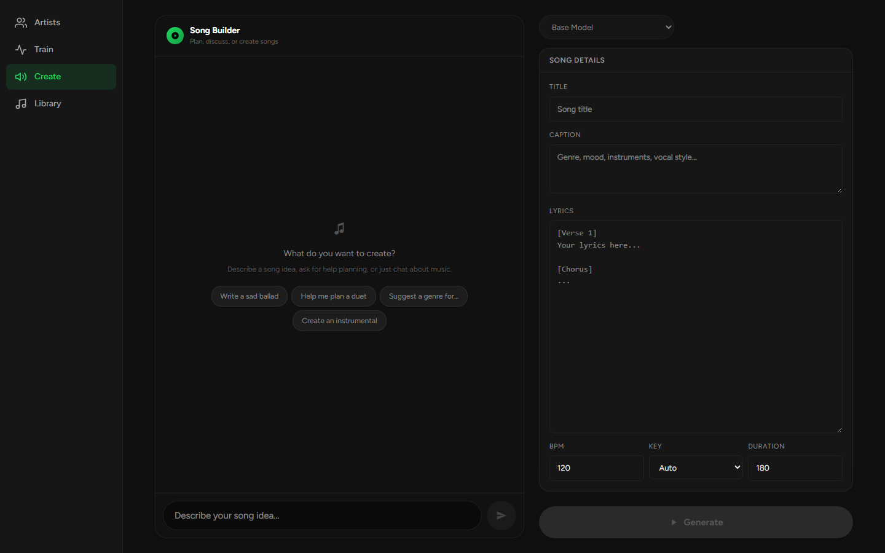
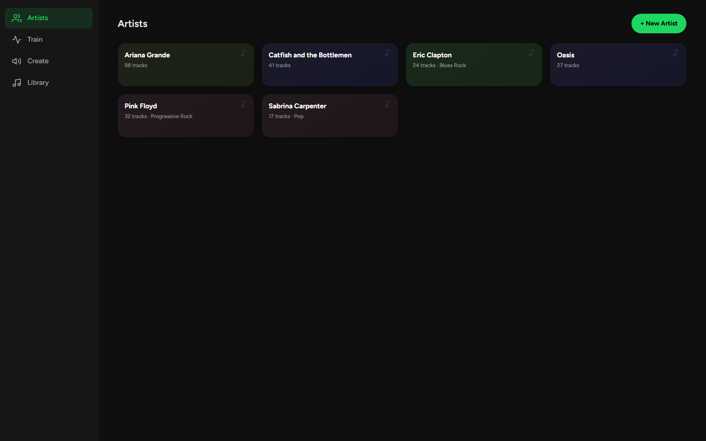
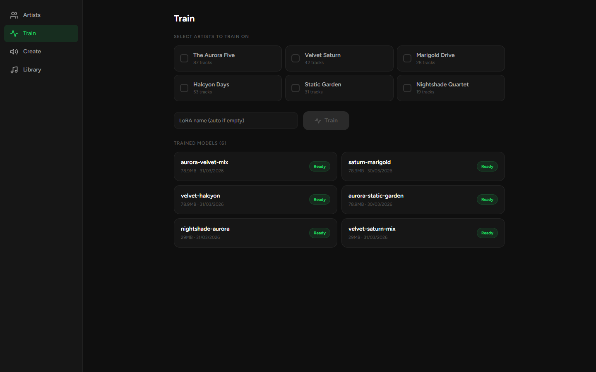
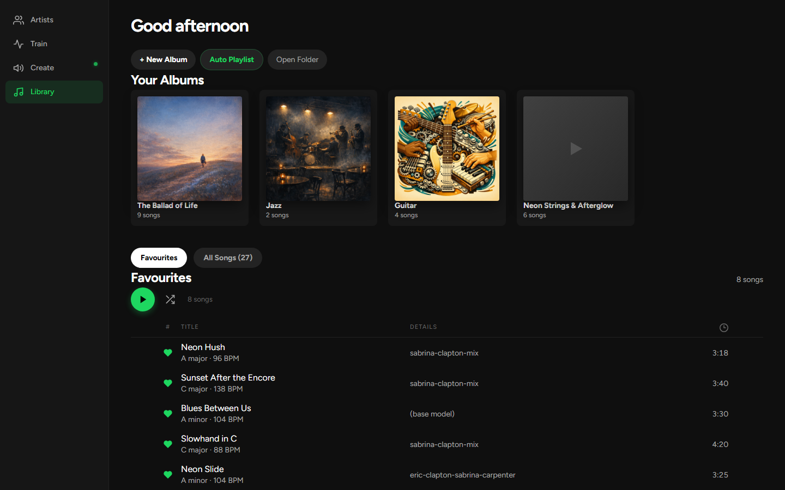
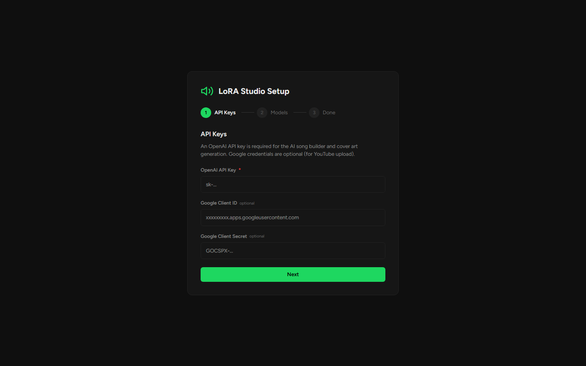

# LoRA Studio

**Make your own music with AI.** Generate songs, train custom voice models, edit tracks, and upload to YouTube — all from your browser.

---

## What is this?

LoRA Studio is a music production app that runs on your PC. You describe a song idea (like "a chill jazz track to fall asleep to") and AI generates the full song — vocals, instruments, everything. You can:

- **Generate songs** from text descriptions
- **Train voice models** on your favourite artists (download their music from YouTube, train a model, generate songs in their style)
- **Edit songs** — repaint sections, strip vocals/instruments, remix
- **Create albums** automatically from a theme
- **Upload to YouTube** with one click
- **Control everything from your phone** (works on any device on your WiFi)

---

## Screenshots

**Create — describe a song, the AI plans it**



**Artists — voice models you've trained**



**Train — mix one or more artists into a LoRA**



**Library — your generated songs and albums**



**First-run setup wizard — API keys and model download**



---

## What you need

| Thing | Why | How to get it |
|-------|-----|---------------|
| **Windows PC** | Runs the AI | You probably have this |
| **NVIDIA GPU (8GB+ VRAM)** | AI needs a graphics card | GTX 1080 minimum, RTX 3060+ recommended |
| **Python** | Runs the code | See install steps below |
| **OpenAI API key** | Powers the AI song builder | See below |

**You do NOT need:**
- Any coding knowledge
- Linux or Mac (Windows only for now)
- Node.js or any other developer tools

---

## Step 1: Install Python

1. Go to **https://python.org/downloads**
2. Download Python 3.12 (or any 3.10+)
3. Run the installer
4. **IMPORTANT: Check the box that says "Add Python to PATH"** ← don't skip this
5. Click Install

To verify it worked, open Command Prompt and type:
```
python --version
```
You should see something like `Python 3.12.x`.

---

## Step 2: Get the app

**Option A: Download the zip** (easiest)
1. Download the latest release from the Releases page
2. Extract the zip somewhere (like `C:\LoRA-Studio`)

**Option B: Clone with Git** (if you have Git installed)
```
git clone https://github.com/ryan75195/lora-studio.git
cd lora-studio
```

---

## Step 3: Run it

1. Open the folder where you extracted/cloned the app
2. Double-click **`start.bat`**
3. Wait — first run takes a few minutes to install everything
4. A browser window should open. If not, go to **http://localhost:8888**

The launcher will:
- Check your Python and GPU ✓
- Install ffmpeg if missing ✓
- Install all dependencies ✓
- Start the server ✓

---

## Step 4: Setup wizard

The first time you open the app, you'll see a setup wizard:

### Get an OpenAI API key
1. Go to **https://platform.openai.com/api-keys**
2. Sign up or log in
3. Click **"Create new secret key"**
4. Copy the key (starts with `sk-...`)
5. Paste it into the setup wizard
6. Click Next

**Cost:** The AI song builder uses GPT to write lyrics and plan songs. It costs roughly $0.01-0.05 per song — very cheap. You'll need to add a payment method to your OpenAI account (there's usually free credit for new accounts).

### Model download
The setup wizard will check if the AI models are downloaded. If not, it'll offer to download them. This is a one-time ~5GB download.

---

## Step 5: Make music!

### Generate a song
1. Go to the **Create** tab
2. Type what you want: "upbeat pop song about summer" or "sad blues ballad with guitar solo"
3. The AI fills in all the details (lyrics, instruments, style)
4. Click **Generate**
5. Wait ~30-60 seconds
6. Listen to your song!

### Train a voice model (LoRA)
Want songs that sound like a specific artist? Train a model:

1. Go to the **Artists** tab
2. Click **+ New Artist**
3. Give it a name (like "my-artist")
4. Click **Import from YouTube** and paste a YouTube playlist URL with their songs
5. Wait for the download to finish
6. Go to the **Train** tab
7. Select the artist and click **Train LoRA**
8. Wait 30-60 minutes
9. Now when you generate songs, select your trained model from the dropdown!

### Upload to YouTube
1. Go to your album in the **Library** tab
2. Click the **...** menu → **Upload to YouTube**
3. Click **Sign in with Google** (first time only)
4. Click **Start Upload**
5. Done — your songs are on YouTube!

---

## Using on your phone

LoRA Studio works on any device connected to the same WiFi:

1. Look at the `start.bat` window — it shows a "Network" URL like `http://192.168.1.100:8888`
2. Open that URL on your phone's browser
3. You can add it to your home screen for an app-like experience:
   - **iPhone:** Safari → Share → Add to Home Screen
   - **Android:** Chrome → Menu → Add to Home Screen

---

## Troubleshooting

### "Python not found"
You didn't check "Add Python to PATH" during install. Reinstall Python and make sure to check that box.

### "NVIDIA GPU not detected"
- Make sure you have an NVIDIA graphics card (not AMD or Intel)
- Update your GPU drivers: https://www.nvidia.com/drivers
- Restart your PC after updating drivers

### Songs generate but sound bad
- Try a different caption/description
- Train a LoRA on the style you want
- Increase the LoRA strength slider (try 1.5)

### "Waiting for models..."
The AI models take 30-60 seconds to load when you first generate a song. This is normal.

### YouTube upload fails
- Make sure you've signed in with Google first
- Your Google account needs to have a YouTube channel

### App is slow on my phone
The app runs on your PC — your phone is just a remote control. If it's slow, your PC might be busy generating a song. Only one song generates at a time.

---

## FAQ

**Is this free?**
The app itself is free. You need an OpenAI API key which costs a few cents per song.

**Does it use the internet?**
- The AI song builder (GPT) needs internet
- Music generation runs 100% locally on your GPU
- YouTube upload needs internet

**Can I use it offline?**
Yes, for music generation. Just skip the AI chat and fill in the caption/lyrics manually.

**What GPU do I need?**
- 8GB VRAM minimum (GTX 1080, RTX 3060)
- 16GB VRAM recommended (RTX 4070+)
- More VRAM = can train better models and generate faster

**Where are my songs stored?**
In the `acestep_output` folder inside the app directory. They're regular MP3 files.

**Can multiple people use it at once?**
Yes — anyone on the same WiFi can open the app in their browser. But only one song generates at a time (they queue up).

---

## Credits

LoRA Studio is built on a lot of excellent open-source work. The big ones:

### Built on
- **[ACE-Step](https://github.com/ace-step/ACE-Step)** — the music generation model and inference pipeline. Everything under `acestep/` is built on the ACE-Step codebase.
- **[nano-vllm](https://github.com/GeeeekExplorer/nano-vllm)** by Xingkai Yu (MIT) — vendored at `acestep/third_parts/nano-vllm/` for fast LLM inference.

### ML / audio
- **[PyTorch](https://pytorch.org/)** + **[Lightning](https://lightning.ai/)** — model framework and training loop
- Hugging Face: **[Transformers](https://github.com/huggingface/transformers)**, **[Diffusers](https://github.com/huggingface/diffusers)**, **[PEFT](https://github.com/huggingface/peft)**, **[Accelerate](https://github.com/huggingface/accelerate)**
- **[Demucs](https://github.com/facebookresearch/demucs)** by Meta — vocal/instrumental separation
- **[OpenAI Whisper](https://github.com/openai/whisper)** — lyric transcription
- **[LyCORIS](https://github.com/KohakuBlueleaf/LyCORIS)** — extended LoRA training
- **[librosa](https://librosa.org/)** — audio analysis (key/BPM detection)

### Web stack
- **[FastAPI](https://fastapi.tiangolo.com/)** + **[Uvicorn](https://www.uvicorn.org/)** — backend
- **[React](https://react.dev/)** + **[Vite](https://vitejs.dev/)** + **[Tailwind CSS](https://tailwindcss.com/)** + **[shadcn/ui](https://ui.shadcn.com/)** — frontend

### Third-party APIs (optional)
- **[OpenAI](https://openai.com/)** — GPT for the song builder, lyric writing, and cover art generation
- **[Kling AI](https://klingai.com/)** — image-to-video for animated cover loops

License headers and full attribution for each vendored dependency live alongside the code (e.g. `acestep/third_parts/nano-vllm/LICENSE`).
